# Architecture — Multi-Agent AI Solution

Architecture documentation for the secured, observable multi-agent chatbot with
an Oracle database digital worker and human-in-the-loop (HITL) approvals.

> **Note on agents:** This system has three specialists. **DataAccessAgent** is
> shown in detail (it performs read/write DB operations with HITL). The other two
> (originally *math* and *weather*) are generalized as **Agent 1** and **Agent 2**
> — interchangeable tool-using specialists with no side effects.

---

## 1. Detailed Architecture Diagram

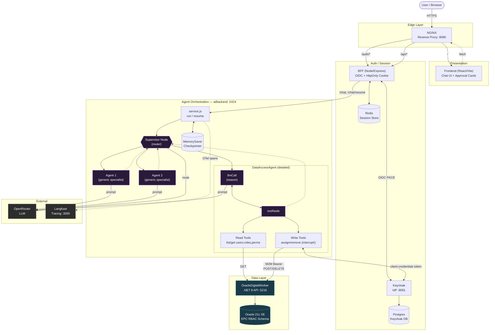

---

## 2. Context Diagram (C4 Level 1)

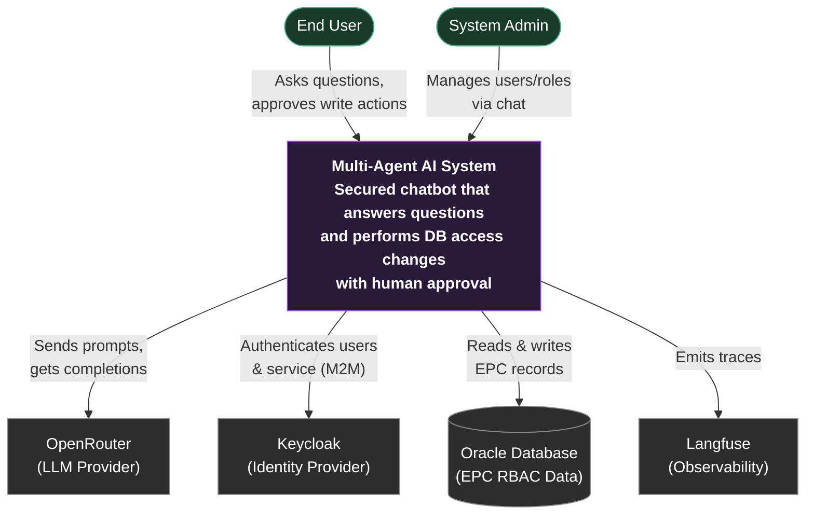

---

## 3. High-Level System / Container Diagram (C4 Level 2)

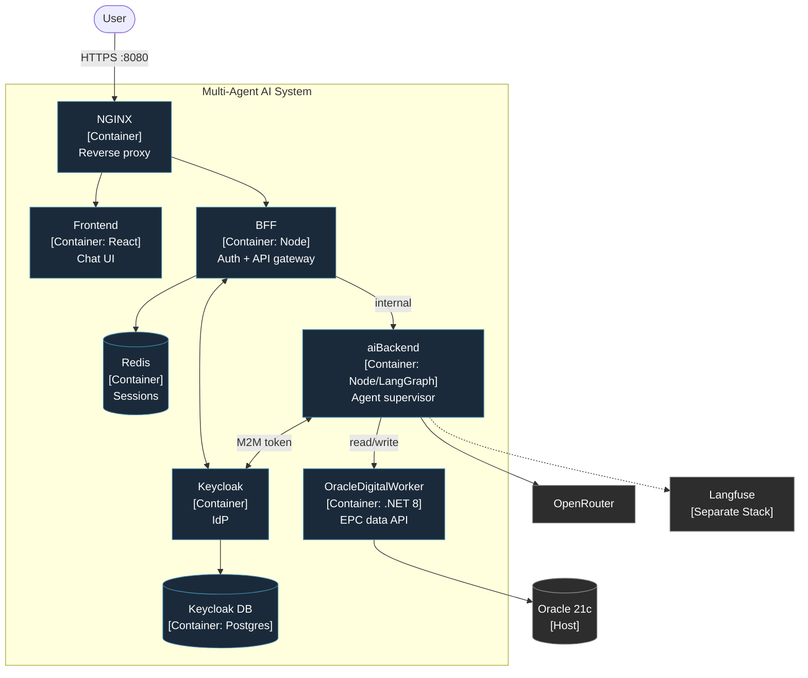

---

## 4. Block / Functional Diagram

```mermaid
flowchart LR
    subgraph PRES["Presentation"]
        F1["Chat Interface"]
        F2["Approval UI"]
        F3["Auth Guard"]
    end

    subgraph SEC["Security / Session"]
        S1["OIDC Login"]
        S2["Session Mgmt"]
        S3["API Proxy"]
        S4["M2M Token"]
    end

    subgraph ORCH["Orchestration"]
        O1["Routing"]
        O2["State Mgmt"]
        O3["Checkpointing"]
        O4["HITL Interrupt"]
    end

    subgraph SPEC["Specialists"]
        SP1["Agent 1"]
        SP2["Agent 2"]
        SP3["DataAccessAgent"]
    end

    subgraph DATAF["Data Functions"]
        D1["Read Ops"]
        D2["Write Ops (auth)"]
        D3["Audit Logging"]
        D4["RBAC Schema"]
    end

    subgraph CROSS["Cross-Cutting"]
        C1["Observability"]
        C2["Error Handling"]
    end

    PRES --> SEC --> ORCH --> SPEC --> DATAF
    ORCH -.-> CROSS
    DATAF -.-> CROSS

    classDef blk fill:#1a2a3a,stroke:#48a,color:#fff
    class F1,F2,F3,S1,S2,S3,S4,O1,O2,O3,O4,SP1,SP2,SP3,D1,D2,D3,D4,C1,C2 blk
```

---

## 5. Component Diagram (DataAccessAgent — detailed)

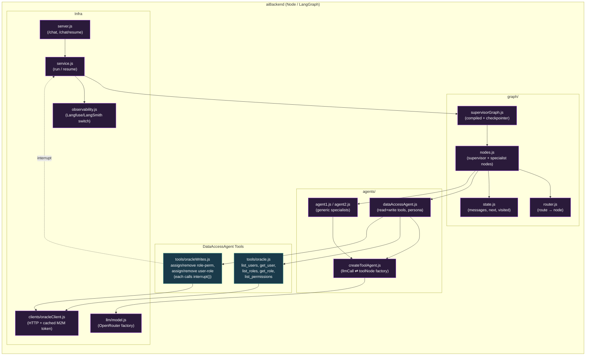

---

## 6. Deployment Diagram

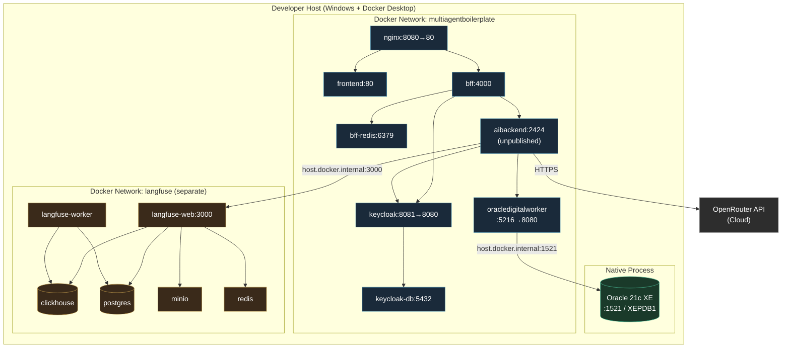

---

## 7. Data-Flow Diagram (DFD)

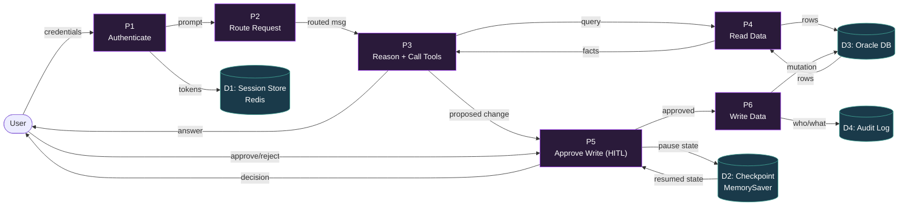

---

## 8. Sequence Diagram (HITL Write Flow — DataAccessAgent)

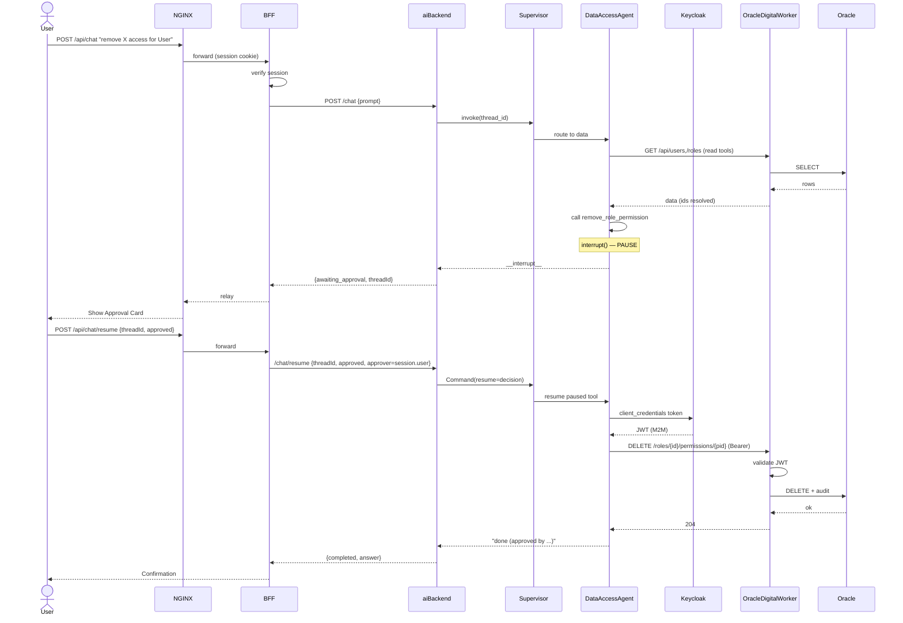

---

## 9. User-Flow / Journey Diagram

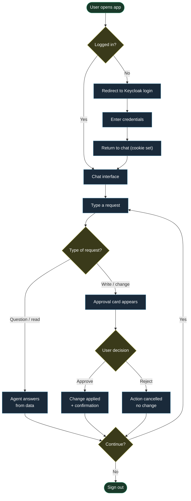

---

## 10. Network Connectivity Diagram

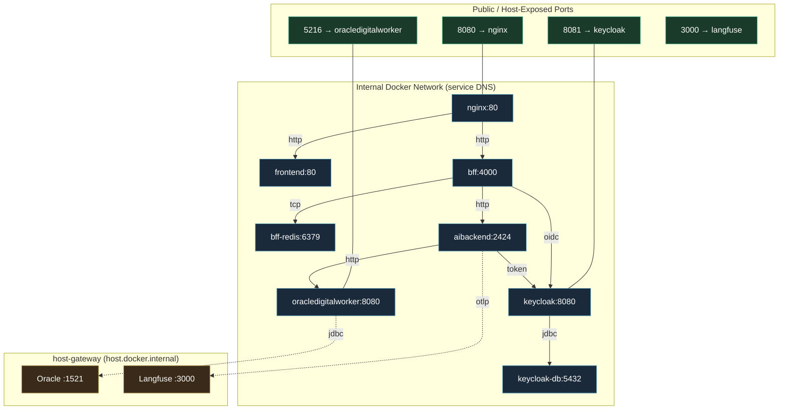

---

## 11. State Diagram (Request / HITL Lifecycle)

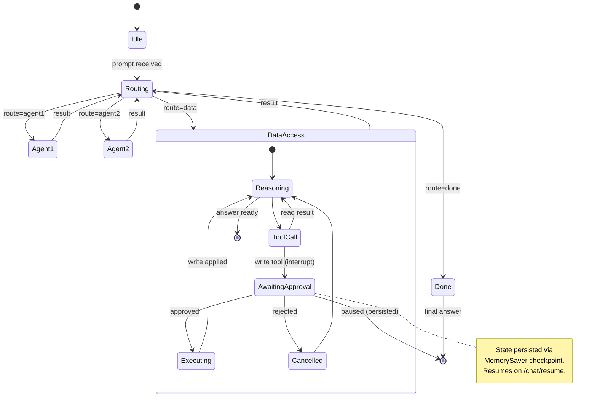

---

## 12. Flowchart / Activity Diagram (Supervisor Loop + HITL)

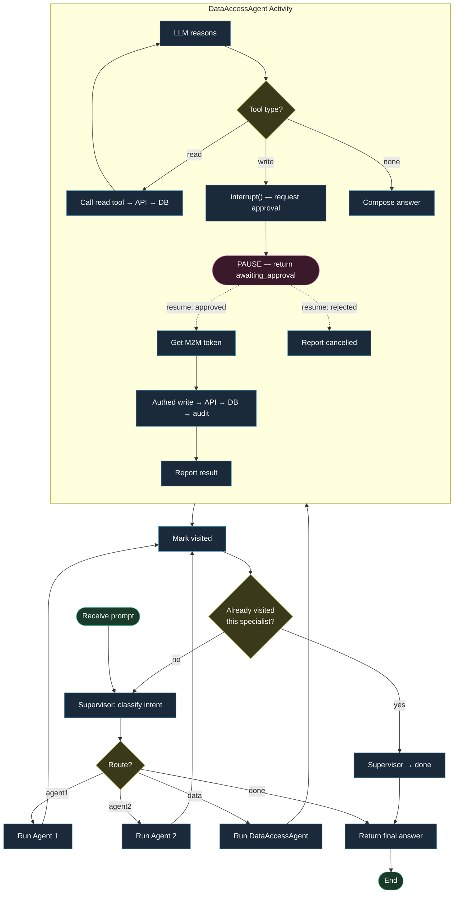

---

## Legend

| Concept | Meaning |
| ------- | ------- |
| **Agent 1 / Agent 2** | Generic tool-using specialists (no side effects) — generalized from the math & weather agents |
| **DataAccessAgent** | The DB digital worker: read tools (open) + write tools (HITL-gated, M2M-authed) |
| **HITL** | Human-in-the-loop: `interrupt()` pauses a write; resumed on user approval |
| **M2M** | Machine-to-machine auth: aiBackend → OracleDigitalWorker via Keycloak client-credentials |
| **Checkpointer** | `MemorySaver` persists paused graph state, keyed by `thread_id` |
| `-.->` | Asynchronous / control-return / optional flow |
| `-->` | Primary request/data flow |
